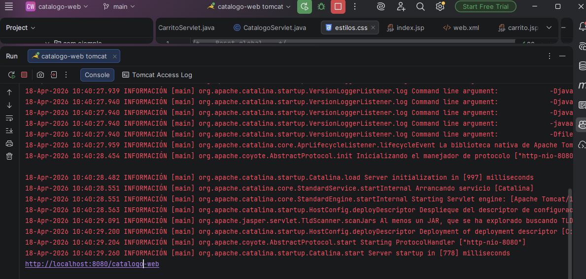
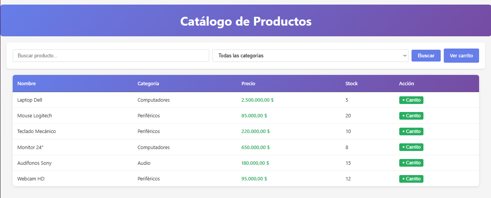
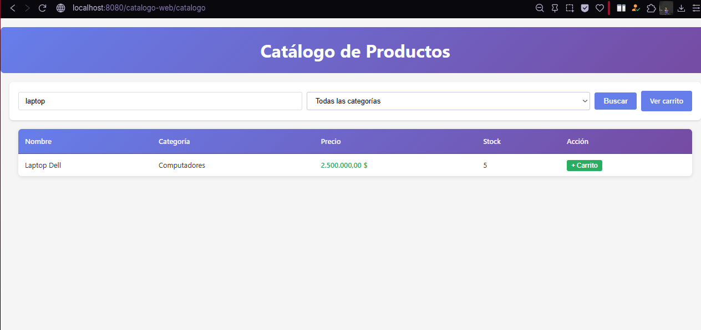
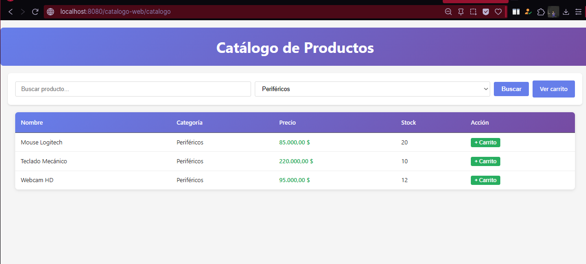
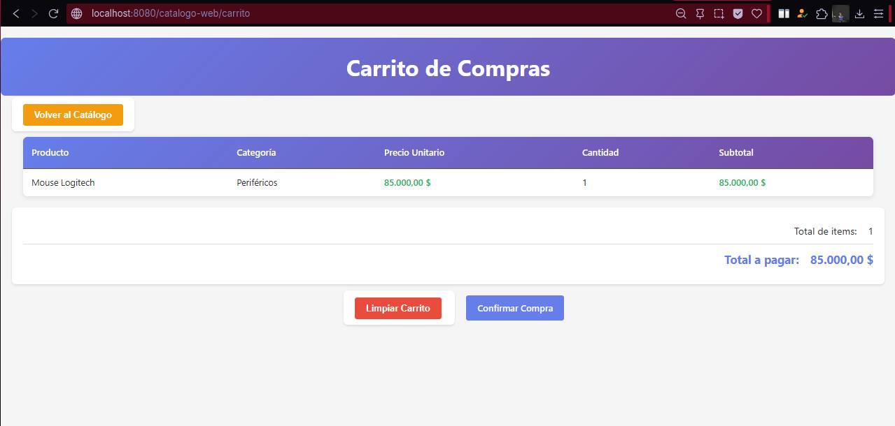
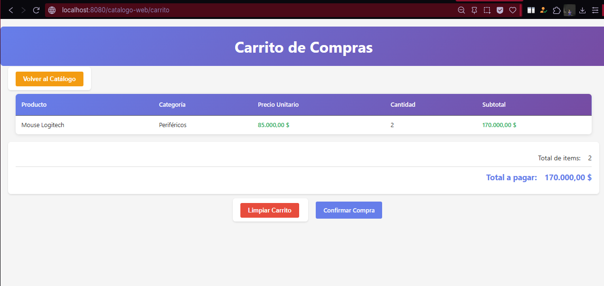
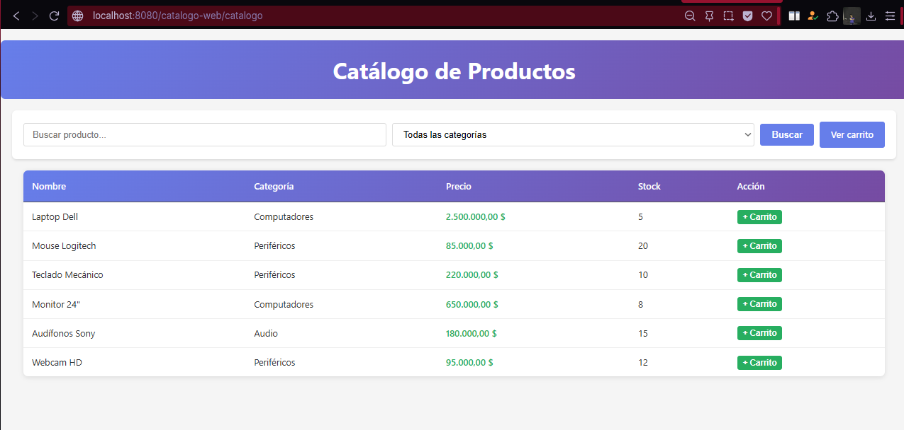

# Catálogo de Productos con Carrito - Java Web

## Autor

**Nombre:** Jhoseth Esneider Rozo Carrillo  
**Código:** 02230131027  
**Programa:** Ingeniería de Sistemas  
**Unidad:** Unidad 5 – Fundamentos de Java Web (Servlets y JSP)
**Actividad:** Post-Contenido 2
**Fecha:** 18/04/2026

---

## Descripción del proyecto

Este proyecto consiste en una aplicación web desarrollada en Java utilizando Servlets, JSP, JSTL y Expression Language. La aplicación implementa un catálogo de productos con funcionalidades de búsqueda, filtrado por categoría y un carrito de compras gestionado mediante sesión HTTP.

Se aplican conceptos clave como el ciclo GET/POST, uso de RequestDispatcher, redirecciones, manejo de sesiones y separación de responsabilidades entre modelo, vista y controlador.

---

## Objetivo

Construir una aplicación web funcional que:

- Muestre un catálogo de productos
- Permita buscar productos por nombre
- Permita filtrar productos por categoría
- Permita agregar productos a un carrito en sesión
- Permita visualizar y limpiar el carrito
- Aplique correctamente el flujo HTTP (GET, POST, forward, redirect)

---

## Tecnologías utilizadas

- Java JDK 17
- Apache Tomcat 10.x
- Maven
- JSP
- JSTL
- HTML5 + CSS3
- IntelliJ IDEA

---

## Estructura del proyecto

- catalogo-web/
- ├── src/main/java/com/ejemplo/
- │ ├── model/
- │ │ ├── Producto.java
- │ │ └── CarritoItem.java
- │ └── servlet/
- │ ├── CatalogoServlet.java
- │ └── CarritoServlet.java
- ├── src/main/webapp/
- │ ├── WEB-INF/
- │ │ ├── web.xml
- │ │ └── views/
- │ │ ├── catalogo.jsp
- │ │ ├── carrito.jsp
- │ │ └── confirmacion.jsp
- │ ├── css/
- │ │ └── estilos.css
- │ └── index.jsp
- └── pom.xml

---

## Funcionalidades implementadas

### Catálogo

- Visualización de productos
- Búsqueda por nombre
- Filtro por categoría

### Carrito

- Agregar productos al carrito
- Incremento automático de cantidad
- Visualización de productos agregados
- Cálculo de subtotal por producto
- Limpieza del carrito

### Flujo HTTP

- GET para mostrar vistas
- POST para acciones (agregar, limpiar)
- Redirecciones después de POST

---

## Ejecución del Proyecto

### 1. Clonar el repositorio

git clone https://github.com/jerc31/rozo-post2-u5.git

### 2. Abrir en IntelliJ IDEA

### 3. Compilar proyecto

desde consola:

mvn clean package

### 4. Configurar Apache Tomcat

- Instalar Apache Tomcat
- Run → Edit Configurations
- Clic en +
- Seleccionar Tomcat Server → Local
- Configurar

### 5. Desplegar aplicación

### 6. Ejecutar aplicación

Abrir en el navegador en:
http://localhost:8080/catalogo-web/

---

## Checkpoints de verificación

- El proyecto compila sin errores
- Se muestran los productos al acceder a /catalogo
- La búsqueda filtra correctamente los resultados
- El filtro por categoría funciona correctamente
- Se pueden agregar productos al carrito
- Al agregar el mismo producto, aumenta la cantidad
- El carrito muestra subtotales correctamente
- El botón "Limpiar carrito" vacía el contenido

---

## Capturas de pantalla

Las siguientes capturas se encuentran en la carpeta `/evidencias/`:

# App compilando sin errores

## App con lista de 6 productos

## Filtro de buscar productos por texto

## Filtro por categoría de productos

## Agregar al carrito

## Agregar mismo producto 2 veces

## Limpiar carrito y redirección a /catalogo

